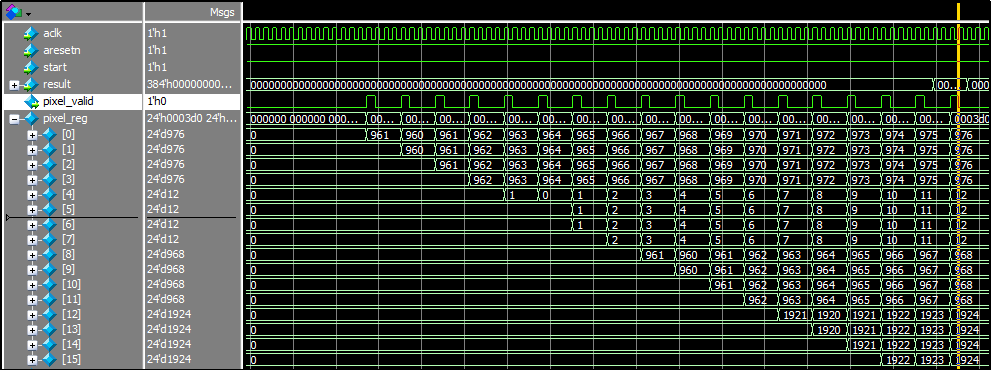
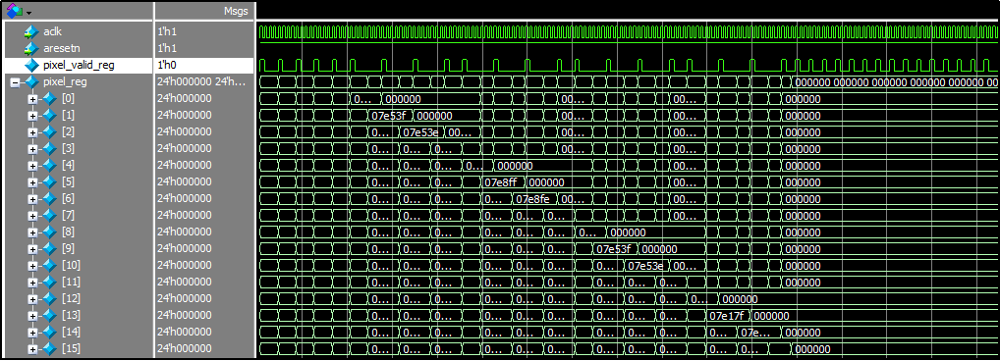
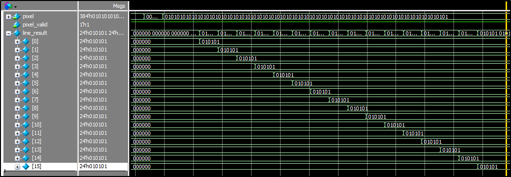

# Result

Under construction ...

---

目前暂时只有两个模块的仿真结果，测试激励详见具体的testbench。其它模块功能和整体功能的demo实现等之后有空再整理。

[in_ctrl_tb.sv](../Logic/bicubic/bicubic.srcs/sim_1/imports/sim/in_ctrl_tb.sv)，输入模块的仿真结果开头的波形：

[in_ctrl_tb.sv](../Logic/bicubic/bicubic.srcs/sim_1/imports/sim/in_ctrl_tb.sv)，输入模块的仿真结果结尾的波形：

[systolic_array_tb.sv](../Logic/bicubic/bicubic.srcs/sim_1/imports/sim/systolic_array_tb.sv)，脉动阵列的测试结果：

