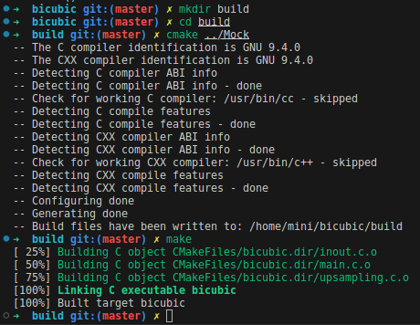
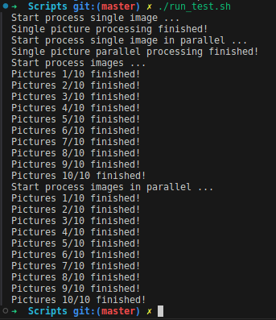

# Scripts

为了模拟硬件电路的功能，这里提供了C语言实现的版本，模拟硬件的计算过程，其结果能够用于与硬件处理结果进行比对，保证结果的正确性。

首先要用cmake构建bicubic可执行程序

```bash
mkdir build
cd build
cmake ../Mock
make
```



构建完成后，可以在Scripts目录下运行[run_test.sh](../Scripts/run_test.sh)脚本，进行单线程和多线程的软件测试。



处理完成后，会在[result](../Scripts/result/)目录下生成上采样后的结果

另外还有两个脚本：

- [cvt2bmp.py](../Scripts/cvt2bmp.py): 将图片缩放为960*540分辨率，并保存为bmp格式
- [kernel_stem.py](../Scripts/kernel_stem.py): 显示一维的卷积核的柱状图

## 图像偏移

差值采用的方式是向原像素点的右下方差值，这样得到的图像就会相对地向左上方偏移。因此最终输出的结果图可以对图像做一定平移。

```c
// inout.c writeSinglePicture_4k
memcpy(pRealloc, pData + dstInfo.biWidth * (dstInfo.biHeight - 1) - 1, sizeof(Pixel) * (dstInfo.biWidth + 1));
memcpy(pRealloc + dstInfo.biWidth + 1, pData, sizeof(Pixel) * (dstInfo.biWidth * (dstInfo.biHeight - 1) - 1));
```

图像平移的这一步是在软件上完成的，数据都已经通过硬件计算得到了，只是通过软件对数据重新排列一下。
