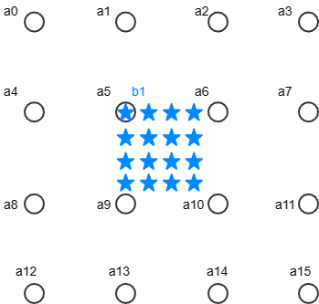

# Systolic

脉动阵列（Systolic）的概念早在1982年就被提出了，[Why systolic architectures?](https://www.cse.wustl.edu/~roger/560M.f17/01653825.pdf)。主要的思想就是从memory读一次数据，做多次运算。

## 脉动阵列

在[理论分析](./Theory.md)中已经知道，bicubic插值本质上就是数字信号处理中的上采样+低通滤波。滤波的过程是用一个卷积核进行卷积运算。卷积核的大小是4×4，待插值的目标像素点周围原有的16个像素分别乘以各自的系数再求和才可以得出一个像素点的值。

$$b_1 = \sum\nolimits_{i = 0}^{i = 15} {{\omega _i}{a_i}} $$

如下图所示，要计算$b_1$像素的值，需要周围$a_0$\~$a_{15}$的值一同参与计算，而系数$\omega_i$的大小则和原有像素与目标像素的距离有关。

从需要做的计算来看，可以做成流水线的形式，15次加法分成15拍完成。乘法器用常系数乘法器，由组合逻辑实现，只要按照顺序依次给出16个像素值，就能在15拍后得到结果。

如果仅有这样一组固定系数的乘法器，那也只能算一类点，图中16个蓝星所在的每个位置都有一组固定的系数，把它们都做成流水线，就有了16条并行的流水线，所以就有了systolic array的形式：

这16条流水线的输入是从上往下传递的，因为原有的16个像素点都是相同的，可以被每条流水线复用。当流水线完全工作起来时，每一拍都可以计算得到16个像素值。

## 系数计算

乍一看脉动阵列16×16的大小，有256个常系数乘法器，感觉很复杂。但实际上很多系数是相同的，没有特别多实例化乘法器的工作，而且常系数乘法器根据系数的不同，所需要的资源也不一样，比如系数是0的乘法器就几乎不消耗逻辑资源。最终总共只有29种不同的系数，[systolic_array.v](../Logic/ip_repo/src/systolic_array.v)中定义了脉动阵列中的乘法器布置。

## 定点小数计算

模块中用FRACTION_BITS控制小数点的位数，虽然在IP打包的时候做成了可调参数，但现在发现，因为乘法器系数已经按照定点小数位数为16进行设置了，所以如果只改FRACTION_BITS，而不改乘法器就会出问题。

<!-- TODO(qiujiandong): 打包输出不能让FRACTION_BITS被修改 -->

## 滑窗

原始图像数据存放在FPGA片外的DDR RAM中。因为每次计算所用到的16个像素值分别来自于连续的4行，因此在模块中需要缓冲4行图像数据，每行有960个像素值。每个像素值包含RGB数据，共24bit。每行数据左侧需要padding一个数据，右侧需要padding两个数据，然后再加一个用来存0值得地址，因此实例化了4个深度为964，位宽为24位的双端口block memory。

## Padding

对于边缘的一些像素点，有的无法在附近找到临近的16个像素点做卷积运算，因此需要在原图周围添加padding。每个像素点对应的15个插值点位于原像素点的右下方，因此padding只需要在上方和左侧添加一行，在右侧和下方添加两行。如下图中的黑色实心圆所示：

