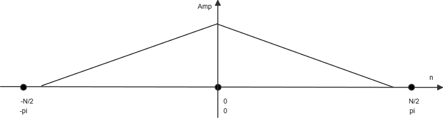
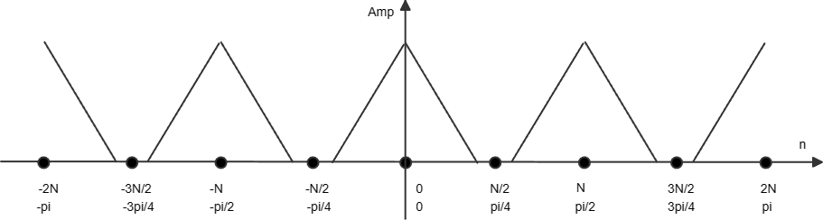
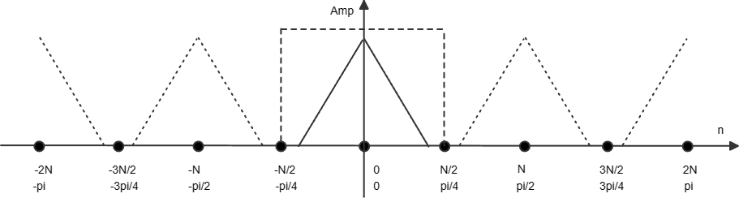
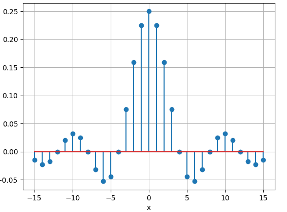
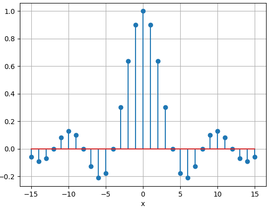
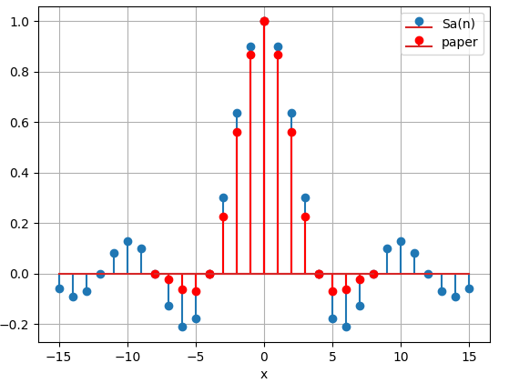

# Theory

双三次插值（Bicubic），利用类似于卷积的方式计算插值点的值。为什么可以这么做？

数字图像可以看作是二维的数字序列，可以做频谱分析。想象有一个实际的连续信号，采样后得到N点的数字序列，在同样的序列长度内增加采样点数即提高采样率，其对应的频谱能够更精细。换句话说，在一个固定长的序列中，增加采样率，能够提高频谱的分辨率，频谱的细节也会更多。

那么反过来，我们已有一个固定长度的数字序列，如何让他能够更加准确地表示实际的连续信号呢？从频谱来看，我们已知的频谱信息是有限的。比如原本采样率是$f_s$，原本的频谱中能表示频率小于$f_s/2$的信息，而如果将采样率提高到$2f_s$，频谱能表示频率小于$f_s$的信息，那么新增的这部分频谱从哪里来呢？我们并不能知道实际的信号（图像）中的这部分频率信息。

最简单的方法就是把这部分新增的频率成分置0，只保留那些我们能够确定的原有的频率成分。用这种简单的插值方法不可能让原本模糊的图像变得更加清晰，因为最基本的频率成分已经确定，插值的指导原则是保证尽可能让这部分频率成分不发生变化，不出现新的频率，保持图像信息的完整性。而如果想让图像中的信息更丰富，增加频率成分，就需要借助一些神经网络的方法了。

在时域插值一般用0插值，然后再进行滤波。因为在时域用0插值，在频域上可以保留原有的频谱，只是有频谱镜像产生，经过低通滤波之后就能保留原有的频率成分。如果用别的值插值，信号的频谱就会发生变化，就没法做到频谱不变了。

比如原有的信号是$x[n]$，它的DFT用$X[k]$表示

$$X[k] = {\sum\nolimits_{n = 0}^{N - 1} {x[n]e} ^{ - j2\pi kn/N}} = \sum\nolimits_{n = 0}^{N - 1} {x[n]W_N^{kn}} $$

它的一个周期内的频谱示意图如下图表示：

用0额外插值3个点之后得到$g[m]$

$$g[m] = \left\{ \begin{array}{l}x[m/4],\;m = 0,4,8,...,4N - 4\\0,\;{\rm{others}}\end{array} \right.$$

$g[m]$的DFT结果：

$$G[t] = \sum\nolimits_{n = 0}^{4N - 1} {g[m]W_{4N}^{tm}}  = \sum\nolimits_{i = 0}^{N - 1} {x[i]} W_N^{ti},\;i = 0,1,2,...,N - 1$$

其中$t$的取值范围是$0,1,2,...,4N-1$，因此$G[t]$是一个形状和$X[k]$相同，且以N为周期的频谱。根据上面的公式，$G[t]$的频谱图如下图，在一个周期内产生多个镜像：

为了保留原始的频谱信息，理论上可以用一个理想的低通滤波器与频谱相乘，滤出我们关心的频率成分。

在理论分析阶段，我们用DTFT来分析计算在时域需要一个什么样的信号进行卷积才能在频域得到理想低通滤波的效果。

$$F[n] = \frac{1}{{2\pi }}\int_{ - \pi }^\pi  {X({e^{j\omega }}){e^{j\omega n}}d\omega  = } \frac{1}{{2\pi }}\int_{ - \pi /4}^{\pi /4} {{e^{j\omega n}}d\omega  = } \frac{{\sin (\pi n/4)}}{{\pi n}}$$

理想的滤波器是不存在的，因为算出来的结果是一个无限长的序列，实际上没法实现。

而且计算得到这个结果后可以发现，它的最大值是0.25，如果直接用它去和用0插值后的序列卷积，得到的结果中每个值都会偏小，原先有值得地方都变成了原来得1/4。这是因为我们在保留频谱形状的同时，把频谱的能量也限制成了和原来一样了。因此滤波器不仅仅需要起到滤波的功能，还需要带有一定的增益，最终可以确定在时域用于滤波的理论上最理想的函数为：

$$F[n] = \frac{{4\sin (\pi n/4)}}{{\pi n}}$$

虽然我们算出来了，但是这个脱离了实际，我们无法用一个无限长的序列进行计算。所以需要一做一点近似。

论文[Cubic Convolution Interpolation for Digital Image Processing](http://hmi.stanford.edu/doc/Tech_Notes/filtergram_interpolation/Keys_cubic_interp.pdf)中提出了一种卷积核，也就是我们所推导出来的采样函数的近似，即下图中红色序列：

这个卷积核是一个有限长的序列，序列的长度不是固定的，与上采样的倍数有关。它只关心原图中距离不超过2像素的点。采样函数采用分段的三次多项式近似，具体推导过程见论文。

$$u(s) = \left\{ \begin{array}{l}1.5{\left| s \right|^3} - 2.5{\left| s \right|^2} + 1,\;\;\;0 \le \left| s \right| < 1\\ - 0.5{\left| s \right|^3} + 2.5{\left| s \right|^2} - 4\left| s \right| + 2,\;\;1 \le \left| s \right| \le 2\;\\0,\;\;\;\left| s \right| > 2\end{array} \right.$$

其中的$s$是亚像素的距离值，如果每个点追加3个像素点，即4倍的上采样，那么这个$s$就有可能使0，0.25, 0.5, 0.75等亚像素的距离值。
